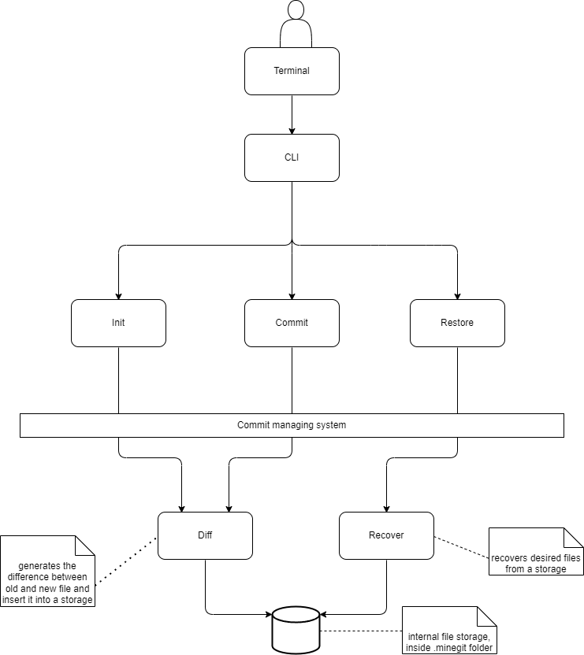

## MineGit
The project provides a version controll system for a minecraft worlds. It is inpired by a git and uses similar princepes of diff files and commits.

MineGit operates independently of the game, working directly with Minecraft world files to enable efficient versioning and backups.

The program should allow players to easily back up their worlds and restore them through the CLI. Git or similar existing programs will not be used for this functionality.

Users are able to specify specific regions(files) that they want to restore/commit

## How it works
The principle of the work of MineGit compared to regular Git is that the core idea is to minimize the required space by introducing diff files. A diff file is a set of instructions used to restore the needed file version, knowing the file content from the previous version and a set of commands describing how to transform it to the next version.

In our project, we used two types of commands: Insert and Copy (copying selected bytes from the previous version).

Similar to Git, the project uses the concept of a package instead of a regular database. A package is a file that stores information about multiple file versions—in our case, for a single file.

Then, commits store the list of files that are part of the commit. This includes the package where the file is located and the offset that indicates which file version it refers to. In that way, when a restore is done, the only thing that needs to be changed is the current offset to return to the desired version.

Compared to Git, we used a different diff generation algorithm. Git uses Myers' algorithm, which is good for human-readable text but performs worse for binary files. Instead, we chose the bsdiff algorithm, which provides smaller delta sizes at the cost of speed. After testing, we concluded that on average, our implementation requires 20% less memory compared to Git.

We also used multithreading to allow different files to be saved in parallel, making the saving process faster.

## Design diagram

## Requirements
- Not damage the data of the user's world.
- Support committing current changes.
- Provide rollback capabilities to restore previous versions.
- Allow users to specify specific regions to be restored or commited.
- Be able to create new commits from the rolled back version.
- Provide a command-line interface (CLI) for managing world versions.

## Dependencies
Dependencies listed here might not be used in the final project:

- bitcode: The bitcode dependency is used for encoding and decoding Commit data. It was chosen based on results from rust_serialization_benchmark, where it demonstrated the fastest serialization and deserialization speeds. Additionally, it produced compact serialized output that compressed especially well with zstd, which we use to compress file descriptions within commits.
- bytemuck: The bytemuck dependency is used for safely converting data structures to and from raw byte slices when a static, predictable memory layout is required-for example, when writing fixed-size entries.
- chrono: The chrono crate is used for working with timestamps and converting them into human-readable date and time formats.
- clap: The clap (Command Line Argument Parser) crate is used to define and parse command-line arguments in a declarative, user-friendly way.
- glob: The glob crate is used to define patterns for matching files or directories. In this project, it helps implement an IgnoreFilter that allows certain files or directories to be excluded from commit based on patterns in ignore file, similar to .gitignore behavior.
- sha2: The sha2 crate is used to calculate and compare file hashes, which helps determine whether a file has changed between commits.
- zstd: The zstd crate is used for compressing commit data, providing high compression ratios and fast decompression speeds.
- tokio: The tokio crate is used to handle asynchronous tasks, allowing for efficient parallel execution of file comparison and commit operations.
- byteorder: this library is used to read and write primitive types from/to a file. Is used for DiffCommand and SnapshotHeader serialization/deserialization
- divsufsort: is used for suffix array generation during file difference generation. Although it is not the fastest library asymptotically, it proved to be the most efficient for our use cases during testing.

## Compatibility
Supports: Minecraft: Java Edition 1.12.2+

## Aditional
MineGit is implemented in the Rust programming language. Since projects like Git require intensive work with memory and file systems, a low-level language is preferred. Therefore, the choice of Rust makes sense, as it offers both low-level control and modern safety features.

## Developed By
This project is being developed by [@ROmanHanushchak](https://github.com/ROmanGanushchak) (Roman Hanushchak) and [@BRUH1284](https://github.com/BRUH1284) (Vladimir Riazantsev)
